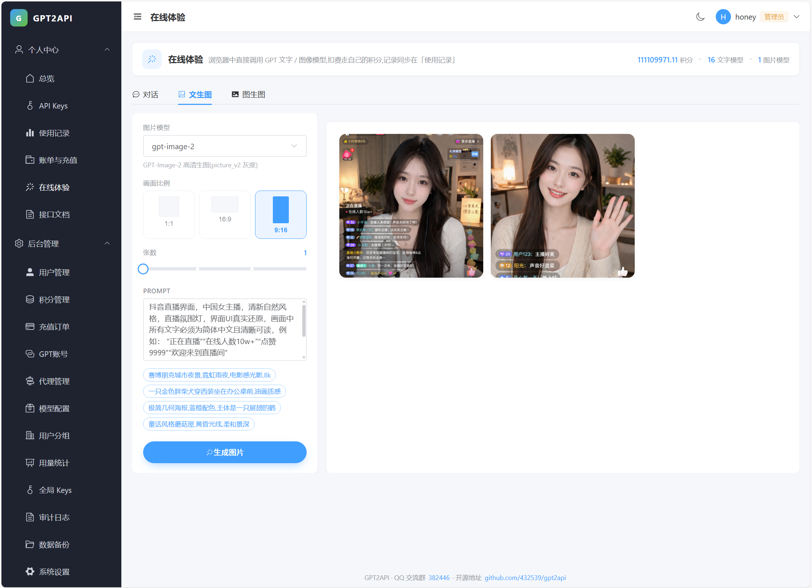

<div align="center">

# gpt2api

**把 ChatGPT 网页版账号，变成一个 OpenAI 兼容的 API 网关。**

自带账号池、代理池、积分计费、管理后台。用官方 SDK 直接调，换个 `base_url` 就行。

[](https://go.dev)
[](https://gin-gonic.com)
[](https://vuejs.org)
[](#测试)
[](LICENSE)

</div>

---

## 30 秒了解

```bash
curl https://your-gateway.com/v1/chat/completions \
  -H "Authorization: Bearer sk-your-key" \
  -H "Content-Type: application/json" \
  -d '{"model":"gpt-5","messages":[{"role":"user","content":"你好"}],"stream":true}'
```

背后发生的事：网关校验你的 Key → 预扣积分 → 从账号池挑一个空闲的 ChatGPT 账号 →
带着完整的浏览器指纹与 PoW 去请求 `chatgpt.com` → 把返回的 SSE 翻译成 OpenAI 协议 →
按真实用量结算，失败全额退款。

**它不是什么**：不是 OpenAI 官方 API 的代理。上游是 ChatGPT 网页版，
能力天花板不同 —— 做不到的东西会**明确报错**，不会假装支持。

---

## 目录

- [能做什么](#能做什么)
- [协议兼容性](#协议兼容性)
- [界面预览](#界面预览)
- [架构](#架构)
- [快速开始](#快速开始)
- [配置](#配置)
- [调用示例](#调用示例)
- [开发](#开发)
- [测试](#测试)
- [常见问题](#常见问题)
- [免责声明](#免责声明)

---

## 能做什么

### 对外：OpenAI 兼容 API

| 端点 | 说明 |
|---|---|
| `POST /v1/chat/completions` | 流式 / 非流式，支持 `stream_options.include_usage` |
| `POST /v1/responses` | 无状态转译垫片（应对按模型名硬路由到 Responses 的客户端） |
| `GET /v1/models`、`GET /v1/models/{id}` | 按 Key 白名单过滤，稳定排序 |
| `POST /v1/images/generations` | 文生图、图生图，`url` / `b64_json` 两种返回 |
| `POST /v1/images/edits` | 多图参考 |
| `GET /v1/images/tasks/{id}` | 异步任务查询（项目扩展） |

用 `openai` 官方 SDK（Python / Node）直接调用，**不需要任何适配层**。

### 对内：一套完整的运营后台

- **账号池** — JSON / AT / RT / ST 四种导入方式，自动刷新、额度探测、风控熔断、
  按账号稳定绑定设备指纹
- **代理池** — HTTP / SOCKS5，健康分探测，按账号强绑定，避免 IP 指纹混用
- **调度器** — 串行 lease + Redis 分布式锁，单号最小间隔、日消耗熔断、429 退避
- **计费** — 积分钱包、预扣结算、分组倍率、充值套餐、易支付接入
- **权限与审计** — JWT 登录、RBAC、管理员写操作全链路审计、高危操作二次确认
- **运维** — 数据库一键备份 / 恢复、上传限额、备份保留策略

---

## 协议兼容性

这是本项目投入最多的地方。核心原则只有一条：

> **上游做不到的能力，必须明确报错，绝不静默忽略。**

静默丢弃一个参数，调用方会以为它生效了 —— 拿到错误结果还查不出原因。
所以每个 OpenAI 参数都归入三档之一：

| 档 | 行为 | 例子 |
|---|---|---|
| **硬拒** | `400` + `error.param` 指向字段 + 说明为什么做不到 | `tools`、`response_format: json_schema`、`n>1`、`stop`、`seed`、`logprobs` |
| **软忽略** | `200`，响应头 `X-Gateway-Ignored-Params` 列出 | `temperature`、`top_p`、`store`、`metadata` |
| **别名** | 静默映射到等价字段 | `max_completion_tokens` → `max_tokens` |

判定用的是**语义有值**，不是字段存在 —— 真实客户端会无条件带上
`"tools":[]`、`"stop":null`、`"n":1`，按 presence 判断会把正常请求全拒掉。
有 34 个用例专门固化这一点。

其他协议细节：

- **错误信封** `code` / `message` / `param` / `type` 四键全输出，空值为 `null`。
  `type` 与状态码语义一致 —— LiteLLM、LangChain 按它决定"换 key / 换渠道 / 退避重试"
- **流中断不伪装成成功**。上游断开或零输出时下发 SSE 错误事件并全额退款，
  不会补一个 `finish_reason:"stop"` 把半截回答当完整答案
- **不编造数字**。上游不返回 token 计数，`prompt_tokens` 是标注过的估算值；
  图片响应干脆不输出 `usage` —— 编一个数字比缺字段更糟
- **限流头齐全**。`x-ratelimit-*` 六件套 + `Retry-After`，SDK 能做预测性退避
- **未实现的官方端点回 `501` 并说明原因**，不是空 body 的 404

**逐项对照表：[`docs/OPENAI_COMPAT.md`](docs/OPENAI_COMPAT.md)**

---

## 界面预览

<table>
<tr>
<td width="50%"></td>
<td width="50%"></td>
</tr>
<tr>
<td align="center"><sub>在线体验 · 文生图 / 批量出图</sub></td>
<td align="center"><sub>管理后台 · 单图放大预览</sub></td>
</tr>
</table>

---

## 架构

```
客户端 (openai SDK / LangChain / Cherry Studio / ...)
   │
   ▼  /v1/*
┌──────────────────────────────────────────────────┐
│  apikey 中间件   鉴权 / IP 白名单 / 模型白名单        │
│  ↓                                               │
│  参数三档校验    硬拒 / 软忽略 / 别名                 │
│  ↓                                               │
│  模型解析 → 限流(RPM/TPM) → 预扣积分                 │
│  ↓                                               │
│  scheduler      拿账号 lease(Redis 分布式锁)       │
│  ↓                                               │
│  upstream/chatgpt   PoW + sentinel + SSE          │
│  ↓                                               │
│  renderer       chat 协议 / responses 协议          │
│  ↓                                               │
│  结算或退款 + usage_logs                            │
└──────────────────────────────────────────────────┘
```

`internal/gateway/chat.go` 的 `runChat` 是主管线。
`/v1/chat/completions` 与 `/v1/responses` 共用它，只有最后的 `renderer` 不同 ——
复制一遍管线的话，两边的计费和退款迟早会走偏。

### 目录

```
cmd/server/            入口
internal/
  gateway/             OpenAI 协议层(参数校验 / 流式 / 图像 / Responses)
  upstream/chatgpt/    chatgpt.com 逆向客户端(sentinel / PoW / SSE / 文件上传)
  scheduler/           账号调度与 lease
  billing/             积分预扣与结算
  ratelimit/           RPM / TPM 令牌桶
  account/ proxy/      账号池、代理池
  apikey/ user/ rbac/  Key、用户、权限
  model/ settings/     模型目录、动态配置
  image/               生图任务与本地放大
pkg/
  oaierr/              OpenAI 错误信封
  safefetch/           出站 SSRF 防护
web/                   Vue 3 管理后台
sql/migrations/        goose 迁移
docs/spec/             项目约定(新会话必读)
```

---

## 快速开始

> ⚠️ **本项目是"宿主预编译 + 容器运行"架构**。容器内**不做** `go build` / `npm install`
> （为规避国内拉 `proxy.golang.org` / npm registry 卡死）。
> 直接 `docker compose up --build` 会报 `deploy/bin/gpt2api: not found`。

### 你需要

**打包机**：Go 1.22+、Node 18+（推荐 20 LTS）、Docker 24+、docker compose v2

**运行环境**：
- 一台能直连 `chatgpt.com` 的 VPS，或至少一个可用的 HTTP / SOCKS5 代理
- 至少 1 个 ChatGPT Plus / Team 账号（能导出 AT / RT / ST 或 JSON 会话）

打包机和运行机不必是同一台 —— `build-local.sh` 默认交叉编译 `linux/amd64`。

### 四步起服务

```bash
# 1) 克隆
git clone https://github.com/jiji262/gpt2api.git && cd gpt2api

# 2) 预编译(产出 deploy/bin/gpt2api、deploy/bin/goose、web/dist)
bash deploy/build-local.sh          # Windows: powershell -File deploy\build-local.ps1

# 3) 配置
cp deploy/.env.example deploy/.env  # 改 MySQL 密码、JWT secret、AES key
                                    # AES key 必须是 32 字节 hex,生产必改

# 4) 起容器(自动跑 goose 迁移)
docker compose -f deploy/docker-compose.yml up -d
```

打开 `http://<你的地址>:8080`，用 `.env` 里的初始管理员账号登录。

### 跑通第一次调用

1. 后台 **账号池 → 导入**，粘贴 ChatGPT 账号凭据
2. 后台 **API Key → 新建**，拿到 `sk-...`
3. 调一次：

```bash
curl http://localhost:8080/v1/chat/completions \
  -H "Authorization: Bearer sk-你的key" \
  -H "Content-Type: application/json" \
  -d '{"model":"gpt-5","messages":[{"role":"user","content":"讲个冷笑话"}]}'
```

拿不到内容？先看 `docker compose logs -f server`，
网关会把上游静默拒绝、账号降级、限流分别报成不同的错误码。

---

## 配置

`configs/config.yaml` 是启动期配置，**任何字段都能用环境变量覆盖**：
`app.listen` → `GPT2API_APP_LISTEN`。

| 组 | 关键项 | 说明 |
|---|---|---|
| `crypto` | `aes_key` | **生产必改**，32 字节 hex，用于加密账号凭据 |
| `jwt` | `secret` | **生产必改** |
| `site` | `api_base_url` | **生产必填**。留空会从 `X-Forwarded-*` 推导，而那些头客户端可伪造 |
| `scheduler` | `min_interval_sec` | 单账号最小间隔，对抗风控的核心参数 |
| `scheduler` | `daily_usage_ratio` | 单号日消耗熔断阈值（0.6 = 用掉 60% 自动下线） |
| `upstream` | `sse_read_timeout_sec` | SSE 两次事件之间的最大间隔，批量出图建议 300+ |
| `gateway` | `vision_enabled` | 图片输入，**默认关**，开启前先读 [`docs/spec/vision.md`](docs/spec/vision.md) |

运行期配置（模型价格、限流、开关）走管理后台，改完即时生效，不用重启。

---

## 调用示例

### Python（官方 SDK）

```python
from openai import OpenAI

client = OpenAI(base_url="http://localhost:8080/v1", api_key="sk-你的key")

# 流式对话
stream = client.chat.completions.create(
    model="gpt-5",
    messages=[{"role": "user", "content": "用一句话解释量子纠缠"}],
    stream=True,
    stream_options={"include_usage": True},
)
for chunk in stream:
    if chunk.choices and chunk.choices[0].delta.content:
        print(chunk.choices[0].delta.content, end="")
    if chunk.usage:
        print(f"\n\n{chunk.usage.total_tokens} tokens")

# 生图
img = client.images.generate(model="gpt-image-2", prompt="赛博朋克风的猫", n=1)
print(img.data[0].url)
```

### 图生图（项目扩展字段）

```bash
curl http://localhost:8080/v1/images/generations \
  -H "Authorization: Bearer sk-你的key" -H "Content-Type: application/json" \
  -d '{
    "model": "gpt-image-2",
    "prompt": "把这张图改成水彩风格",
    "reference_images": ["https://example.com/cat.png"]
  }'
```

`reference_images` 不是 OpenAI 标准字段，是本项目的扩展 ——
标准写法请用 `POST /v1/images/edits` 上传 multipart。

### 参数被拒时长什么样

```jsonc
// 请求带了 "tools": [{...}]
{
  "error": {
    "message": "参数 tools 暂不支持：上游没有工具调用通道，工具定义无法下发，模型永远不会返回 tool_calls。若只是想让模型输出结构化内容，请在 prompt 里描述格式并自行解析（本网关上游为 chatgpt.com 网页版）",
    "type": "invalid_request_error",
    "param": "tools",
    "code": "unsupported_parameter"
  }
}
```

**为什么这样设计**：报错比静默丢弃好。调用方能立刻知道该换方案，
而不是拿着一个"模型好像不会用工具"的错误结论排查半天。

---

## 开发

```bash
make test          # go test ./...
make build         # 编译到 bin/
make migrate-up    # goose up(需要先起 MySQL)
make fmt vet       # 格式化 + 静态检查
```

后端热跑：

```bash
cp configs/config.example.yaml configs/config.yaml   # 改成本机 MySQL / Redis
go run ./cmd/server
```

前端：

```bash
cd web && npm install && npm run dev   # 默认代理到 localhost:8080
```

### 动手前先读

`docs/spec/` 下有三份文件，记的都是这个项目**特有的坑**，不是通用规范：

- [`conventions.md`](docs/spec/conventions.md) — 12 条约定，每条都写了踩过什么坑
- [`pricing.md`](docs/spec/pricing.md) — 计费换算口径的唯一真源
- [`vision.md`](docs/spec/vision.md) — 图片输入为什么默认关，以及怎么验证

最容易踩的三个：

1. **静默失败** — 上游做不到的东西必须明确报错
2. **payload 形状** — 改上游 payload 必须有 HAR 抓包证据。形状不对时上游**不报错**，
   而是下发一条隐藏的空 system message，表现为"有 SSE 事件但正文为空"
3. **默认值判定** — `"tools":[]` 不等于要用工具

---

## 测试

```bash
go test ./... -race
```

279 个用例，覆盖协议形状、流式事件序列、计费退款路径、限流分桶、
SSRF 防护、路由挂载。

测试注释写的是"**为什么**"而不是"测什么"：

```go
// TestStreamUpstreamErrorEmitsErrorEvent 覆盖 F9:
// 此前上游中途断开也照发 finish_reason:"stop" + [DONE],客户端把半截回答当完整答案。
```

这类注释告诉后来者：这条断言不能随手删。

**未覆盖的部分**（诚实说明）：数据库迁移与真实上游链路需要 MySQL + Redis +
ChatGPT 账号才能验证，CI 里没有。

---

## 常见问题

<details>
<summary><b>有 SSE 事件但正文是空的</b></summary>

上游把请求判成了"非标准客户端"，下发一条隐藏的空 system message 静默拒绝。
常见原因：payload 形状不对、模型 slug 是裸品牌名（`gpt-5` 而不是灰度号 `gpt-5-3`）、
免费账号请求了高级模型。

网关会把这种情况判为 `upstream_empty_output`，返回 502 并**全额退款**，
不会把运维提示当正文返回给你。
</details>

<details>
<summary><b>为什么 <code>tools</code> / Structured Outputs 用不了</b></summary>

上游是 ChatGPT 网页版，没有工具调用通道，也没有 schema 约束通道。
这不是网关偷懒，是能力天花板。所以选择明确 400 而不是静默忽略 ——
后者会让你以为"模型不会用工具"，实际是网关吞了参数。

替代做法：在 prompt 里描述你要的格式，对结果做容错解析。
</details>

<details>
<summary><b>客户端一直打到 <code>/v1/responses</code></b></summary>

langchain-openai 对任何含 `codex` 的模型名强制走 Responses；
LobeChat 对部分 gpt-5.x 档位强制走且用户设置覆盖不了；
Vercel AI SDK 的 `openai('id')` 默认就是 Responses。

本项目提供了无状态转译垫片，直接能用。但 `previous_response_id`、
`conversation`、`background` 这些依赖服务端状态的字段会明确拒绝 ——
网关不留存响应，假装支持只会给出错误结果。
</details>

<details>
<summary><b>忘了管理员密码</b></summary>

用任意装了 Go 的机器生成 bcrypt hash，直接写进 `users.password_hash`：

```bash
cat > /tmp/h.go <<'EOF'
package main
import ("fmt";"golang.org/x/crypto/bcrypt")
func main(){ b,_ := bcrypt.GenerateFromPassword([]byte("你的新密码"), 10); fmt.Println(string(b)) }
EOF
cd /tmp && go mod init h && go get golang.org/x/crypto/bcrypt && go run h.go
```

把输出的 `$2a$10$...` 整行写进数据库即可。
</details>

<details>
<summary><b>能改成用官方 OpenAI API 做上游吗</b></summary>

可以，但那样就不需要这个项目了 —— 直接用官方 SDK 即可。
本项目的全部价值在于"把网页版账号变成 API"，
以及围绕它的账号池、计费、风控这一整套运营设施。
</details>

---

## 免责声明

- 本项目通过逆向 `chatgpt.com` 网页协议实现，**不是 OpenAI 官方产品**，
  与 OpenAI 无任何关联
- 使用本项目可能违反 OpenAI 的服务条款，**账号被封禁的风险由使用者自行承担**
- 仅供学习与技术研究，**请勿用于商业倒卖**
- 作者不对使用本项目造成的任何直接或间接损失负责

用之前请想清楚上面四条。

## 许可

[MIT](LICENSE) © jiji262

---

<div align="center">
<sub>如果这个项目对你有用，点个 star 就是最好的反馈。</sub>
</div>
